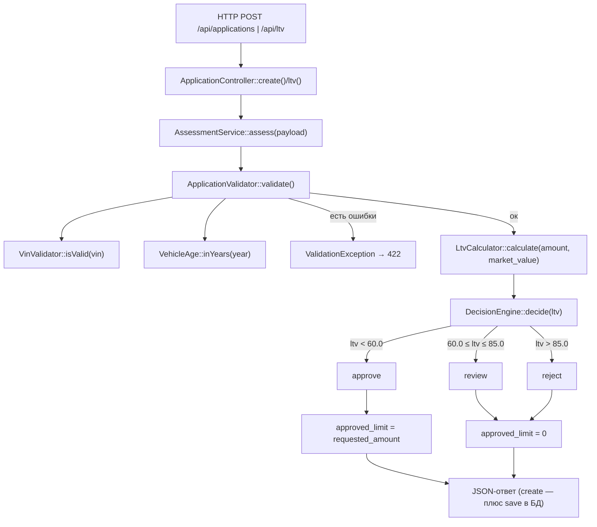

# Карта логики решения approve / review / reject

Дата анализа: 2026-09-26. Область: `backend/src/Domain/`, `backend/config/rules.php`,
плюс точки сборки и входа (`AppFactory`, `ApplicationController`) — для порядка вызовов.
Анализ только по чтению кода, без изменений.

## 1. Какие файлы участвуют и в каком порядке вызываются функции

### Конфигурация и сборка

- `backend/config/rules.php` — все бизнес-числа (пороги VIN, года, пробега, суммы, срока, LTV)
- `backend/src/AppFactory.php` — точка сборки: `require config/rules.php` (строка 27), затем
  конструируются `ApplicationValidator` (с `VinValidator` и `VehicleAge`), `LtvCalculator`,
  `DecisionEngine($rules['ltv'])`, `VehicleAge` — и всё передаётся в `AssessmentService`
  (строки 30–39)
- `backend/src/Http/ApplicationController.php` — вход: `create()` (POST /api/applications)
  и `ltv()` (POST /api/ltv) вызывают `AssessmentService::assess()`

### Домен (`backend/src/Domain/`)

| Файл | Роль |
|---|---|
| `AssessmentService.php` | оркестратор: валидация → LTV → решение |
| `ApplicationValidator.php` | проверка полей, нормализация входа |
| `VinValidator.php` | формат VIN |
| `VehicleAge.php` | возраст = текущий год − год выпуска |
| `LtvCalculator.php` | LTV в процентах |
| `DecisionEngine.php` | LTV → `approve`/`review`/`reject` |
| `ValidationException.php` | ошибки валидации (поле → сообщение) |

### Порядок при обработке заявки

1. `ApplicationController::create()/ltv()` → `AssessmentService::assess($payload)`
2. `ApplicationValidator::validate($payload)`:
   - VIN → `VinValidator::isValid()` (17 символов, A–Z/0–9, без I/O/Q — из `rules['vin']`)
   - год: `VehicleAge::inYears()`; ошибки при годе < 1990 (`min_year`), возрасте < 0
     или > 20 (`max_age_years`)
   - пробег: 0 ≤ mileage ≤ 500 000 (`rules['vehicle']['max_mileage_km']`)
   - `market_value` > 0; `requested_amount` 50 000–2 000 000 (`rules['amount']`);
     срок 3–48 мес. (`rules['term']`)
   - есть ошибки → `throw ValidationException` → контроллер возвращает 422 `{errors}`,
     **решение не считается**
   - нет ошибок → возвращает нормализованный массив
     `['vin','year','mileage','market_value','requested_amount','term_months']`
3. `LtvCalculator::calculate(requested_amount, market_value)` =
   `round(amount / value * 100, 2)` (внутри защитные `InvalidArgumentException`
   при значении ≤ 0 — но валидатор такие туда уже не пропустит)
4. `DecisionEngine::decide($ltv)` — само решение
5. Сборка результата: `vehicle_age` (снова через `VehicleAge::inYears`), `ltv`,
   `decision`, `approved_limit` (= `requested_amount` при approve, иначе 0), `input`
6. Контроллер: `create()` дополнительно сохраняет заявку через
   `ApplicationRepository::save()` и отвечает 201

### Точное правило решения

`DecisionEngine::decide()`, строки 30–41, пороги из `rules['ltv']`:

- `ltv < 60.0` → `approve`
- `60.0 ≤ ltv ≤ 85.0` → `review`
- `ltv > 85.0` → `reject`

Фактическое наблюдение: комментарии в `rules.php` (строки 39–41) и docblock
`DecisionEngine` (строки 10–12) описывают границу как `LTV <= approve_max -> approve`,
но код сравнивает **строго** `$ltv < $this->approveMax`. То есть LTV ровно 60.00 даёт
`review`, а не `approve`.

Ещё одно: `rules['ltv_by_age']` заполнен в конфиге, но кодом **нигде не используется** —
упоминается только в комментарии `AssessmentService` как несделанная задача LOAN-12.

## 2. Куда встанет правило «пробег ≤ 400 000 км, иначе review»

Решение рождается ровно в одном месте — `DecisionEngine::decide()`. Значит, по архитектуре
правило встаёт **в `DecisionEngine::decide()`**. Но сейчас это невозможно без изменений,
потому что:

- конструктор `DecisionEngine` принимает только
  `array{approve_max: float, review_max: float}` (строки 23–28);
- `decide()` принимает только `float $ltv` (строка 30) — пробег в движок **не поступает**.

Что потребовалось бы (описание, не правка):

1. `rules.php` — новый порог 400 000 (например, в секции `vehicle` или отдельной секции;
   по конвенции числа не хардкодятся в коде). **Сейчас числа 400 000 в конфиге нет.**
2. `DecisionEngine` — расширить конструктор (новый порог) и сигнатуру:
   `decide(float $ltv, int $mileage)`.
3. `AssessmentService::assess()` — строка 33: передать `$input['mileage']`
   (данные уже там).
4. `AppFactory` — строка 37: передать новый порог в конструктор `DecisionEngine`.

**Место внутри `decide()`** зависит от семантики, которую код сейчас не фиксирует —
это надо уточнять в спеке:

- если «пробег > 400k понижает approve до review, reject остаётся reject» — проверка
  **после** LTV-веток (LTV сказал approve, а пробег превышен → вернуть `REVIEW`);
- если «пробег > 400k → review всегда, перебивает и reject» — проверка **до** LTV-веток
  (ранний возврат `REVIEW`).

Альтернатива без правки `DecisionEngine` — в `AssessmentService::assess()` сразу после
строки 33 скорректировать `$decision`: `$input['mileage']` там уже доступен. Но тогда
правило решения живёт вне `DecisionEngine`, где сейчас сосредоточена вся логика решения.

Важное пересечение: `ApplicationValidator` уже не пропускает пробег > 500 000
(422 до всякого решения). Значит новое правило реально сработало бы только на диапазоне
**400 000 < mileage ≤ 500 000**.

## 3. Какие входные данные для правила уже есть, а каких не хватает

### Есть

- нормализованный `mileage` (int): валидатор возвращает его в строке 78, `assess()`
  кладёт в `$input` — доступен на шаге вызова `decide()` (строки 32–33);
- `rules['vehicle']['max_mileage_km'] = 500000` — но это валидационный потолок,
  а не порог решения;
- константа `DecisionEngine::REVIEW`.

### Нет

- порога 400 000 в `rules.php` — **нет** (из «пробежных» чисел в конфиге только 500000);
- передачи пробега в `DecisionEngine` — **нет** (ни в конструктор, ни в `decide()`);
- в `DecisionEngine` каких-либо правил решения кроме LTV — **нет**;
- механизма приоритета/переопределения правил (что важнее: LTV-reject или
  пробег-review) — **нет**.

## 4. Что в коде уже сейчас проверяется про пробег

Ровно **одна** проверка: `ApplicationValidator::validate()`, строки 43–46:

- `$mileage = (int)($payload['mileage'] ?? -1)` — поле обязательно (отсутствие даёт −1
  и ошибку);
- ошибка, если `mileage < 0` или `mileage > 500000`
  (`rules['vehicle']['max_mileage_km']`);
- сообщение: «Пробег от 0 до 500000 км»;
- при ошибке — `ValidationException` → 422, решение не считается вовсе.

Нюанс: это проверка только диапазона, не формата — `(int)`-каст превращает нечисловую
строку в 0, и она пройдёт как пробег 0.

Больше пробег нигде не участвует:

- в LTV — **нет** (`LtvCalculator` принимает только сумму и стоимость);
- в решении — **нет** (`decide()` о пробеге не знает);
- в `approved_limit` — **нет**;
- прочие проверки VIN/года/суммы/срока к пробегу отношения не имеют;
- единственное другое использование — `ApplicationRepository::save()` записывает
  `mileage` в таблицу `vehicles` (`mileage_km`), но это хранение, а не проверка.
